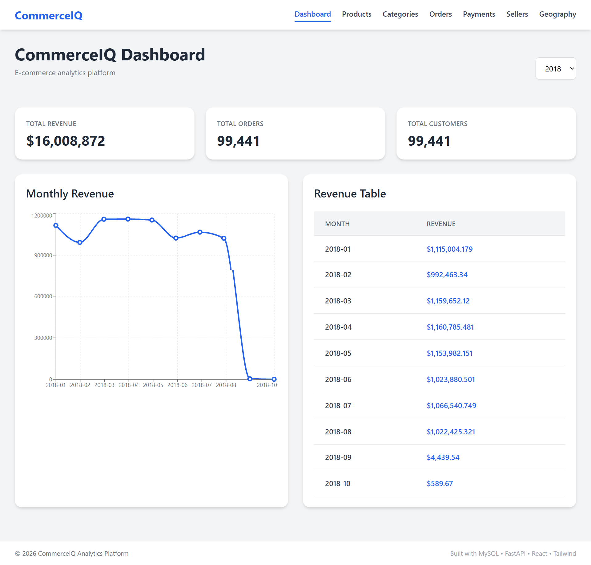

<h1 align="center">CommerceIQ</h1>

<p align="center">
Full-Stack E-Commerce Analytics Platform
</p>

<p align="center">
  
</p>

<p align="center">
  
  
  
  
  
</p>
```md
---

# Overview

CommerceIQ is a production-style analytics platform that transforms raw e-commerce transaction data into interactive business intelligence dashboards.

The project demonstrates a complete end-to-end analytics engineering workflow:

- ETL pipelines with Pandas
- Relational database modeling
- Advanced SQL analytics
- FastAPI backend APIs
- React analytics dashboard
- Interactive business visualizations

---

# Architecture

```text
CSV Dataset
     ↓
Pandas ETL Pipeline
     ↓
MySQL Relational Database
     ↓
SQL Analytics Queries
     ↓
FastAPI Backend APIs
     ↓
Axios API Requests
     ↓
React Frontend Dashboard
     ↓
Charts, KPIs & Business Insights
```

---

# Features

## Backend

- MySQL relational database
- ETL pipeline using Pandas
- Modular FastAPI architecture
- SQL query separation
- KPI analytics
- Revenue analytics
- Product analytics
- Seller analytics
- Geography analytics
- Payment analytics
- Time-series SQL analysis

## Frontend

- Responsive React dashboard
- Tailwind CSS UI
- Interactive Recharts visualizations
- KPI cards
- Dynamic analytics tables
- Multi-page dashboard routing
- Loading states and reusable components

---

# Tech Stack

## Backend
- Python
- FastAPI
- SQLAlchemy
- Pandas
- PyMySQL
- MySQL

## Frontend
- React
- Tailwind CSS
- Axios
- Recharts
- React Router

## DevOps
- Docker
- GitHub

---

# Database Schema

Main tables:

```text
customers
orders
order_items
products
sellers
payments
reviews
```

Relationships:

```text
customers
   ↓
orders
   ↓
payments

orders
   ↓
order_items
   ↓
products

order_items
   ↓
sellers
```

---

# Analytics APIs

| Endpoint | Description |
|---|---|
| `/kpis` | Business KPIs |
| `/monthly-revenue` | Monthly revenue trends |
| `/monthly-growth` | Revenue growth analytics |
| `/average-order-value` | Average order value |
| `/top-products` | Top products |
| `/top-categories` | Product category analytics |
| `/daily-orders` | Daily order trends |
| `/order-status` | Order status distribution |
| `/payment-analysis` | Payment method analytics |
| `/top-sellers` | Seller performance |
| `/top-states` | Customer geography analytics |

---

# Dashboard Pages

- Dashboard
- Products Analytics
- Categories Analytics
- Orders Analytics
- Payments Analytics
- Sellers Analytics
- Geography Analytics

---

# Project Structure

```text
commerceiq-analytics-platform/
│
├── backend/
│   ├── app/
│   ├── queries/
│   ├── requirements.txt
│   └── data_loader.py
│
├── frontend/
│   ├── public/
│   ├── src/
│   │   ├── components/
│   │   ├── pages/
│   │   └── services/
│   └── package.json
│
├── data/
├── docs/
├── .env
├── docker-compose.yml
└── README.md
```

---

# Installation

## Clone Repository

```bash
git clone https://github.com/QosainBukhari/CommerceIQ_Analytics_Platform.git
```

---

# Backend Setup

## Navigate to backend

```bash
cd backend
```

## Create virtual environment

```bash
python -m venv commerceiq-venv
```

## Activate virtual environment

### Windows

```bash
commerceiq-venv\Scripts\activate
```

### Linux / Mac

```bash
source commerceiq-venv/bin/activate
```

## Install dependencies

```bash
pip install -r requirements.txt
```

## Run backend

```bash
uvicorn app.main:app --reload
```

Backend runs at:

```text
http://127.0.0.1:8000
```

---

# Frontend Setup

## Navigate to frontend

```bash
cd frontend
```

## Install dependencies

```bash
npm install
```

## Run frontend

```bash
npm run dev
```

Frontend runs at:

```text
http://localhost:5173
```

---

# Environment Variables

Create `.env` file in project root:

```env
DB_HOST=localhost
DB_PORT=3306
DB_USER=root
DB_PASSWORD=yourpassword
DB_NAME=commerceiq_db
```

---

# Dataset

Dataset Used:
Brazilian E-Commerce Public Dataset by Olist

Source:
https://www.kaggle.com/datasets/olistbr/brazilian-ecommerce

---

# Future Improvements

- Docker deployment
- Cloud deployment
- Authentication system
- Query optimization
- Redis caching
- Forecasting analytics
- Machine learning integration

---

# Learning Outcomes

This project demonstrates:

- Relational database design
- ETL pipelines
- SQL analytics engineering
- FastAPI backend development
- React dashboard engineering
- API integration
- Business intelligence systems
- Full-stack analytics architecture

---

# Author

Qosain Bukhari

---

# License

This project is built for educational and portfolio purposes.
```